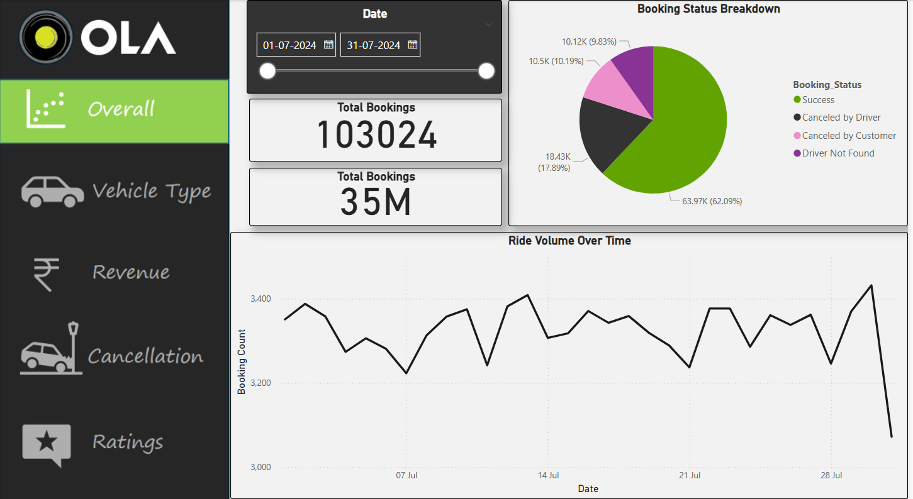
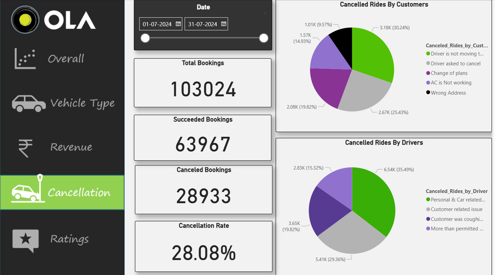
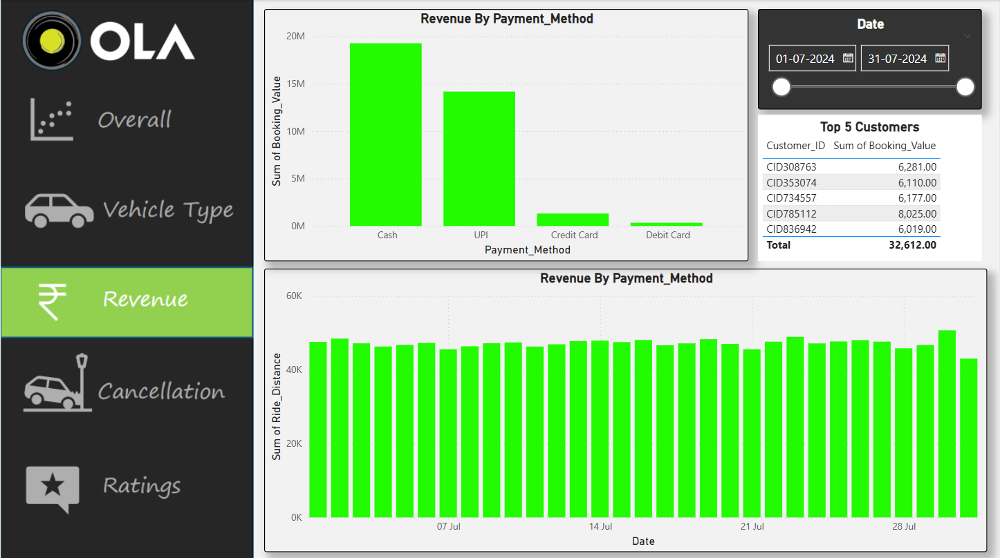
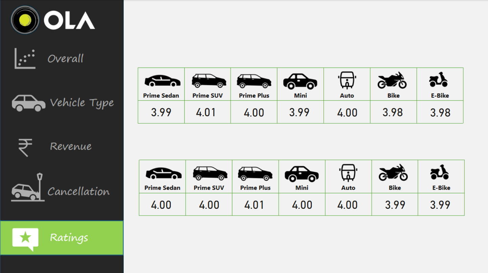

# 🚕 Ola Ride Analytics Dashboard – Power BI + SQL

This project is a **Power BI Dashboard** powered by **SQL insights** that analyzes ride data from a ride-hailing platform like Ola. It uncovers patterns in bookings, cancellations, ride distances, payment modes, and user ratings. Ideal for transport analysts or data-driven product teams.

---

## 🔍 Key Insights

* 🚖 **Total Ride Metrics**: Bookings, Cancellations, Revenue
* 📉 **Cancellation Reasons**: Driver vs Customer breakdown
* 🚗 **Vehicle Performance**: Avg distance by type (Mini, Sedan, SUV)
* 💳 **Payment Mode Analysis**: UPI, Cash, Card
* ⭐ **Customer & Driver Ratings**
* 🧍‍♂️ **Top 5 Customers** with most bookings
* ⏳ **Time Trends**: Ride volume over months

---

## 🧠 SQL Query Logic

1. ✅ All successful bookings
2. 📏 Avg ride distance by vehicle type
3. ❌ Total customer cancellations
4. 🧑‍💼 Top 5 customers by ride volume
5. 🚫 Driver cancellations due to personal/car issues
6. ⭐ Max & min driver rating (Prime Sedan)
7. 💸 Total revenue from completed rides
8. 📱 Rides paid via UPI
9. 🎯 Avg customer rating per vehicle
10. 📄 Incomplete rides with reason

---

## 📊 Power BI Dashboard Pages

1. **Overview**

   * Total Bookings, Revenue, Distance, Ratings
   * Monthly performance with filters

2. **Cancellations**

   * Rides cancelled by Driver vs Customer
   * Reason-wise breakdown

3. **Revenue & Ratings**

   * Payment method distribution
   * Avg driver & customer ratings over time

4. **Vehicle Type**

   * Performance by Mini, Sedan, SUV
   * Avg distance and revenue comparison

5. **Top Users**

   * Top 5 customers by total bookings
   * Filter by vehicle type and time

---

## ⚙️ Tools Used

* **Power BI Desktop**
* **Microsoft SQL Server**
* **DAX**
* **Excel (Data Cleaning)**

---

## 📁 Folder Structure

```
Ola-Ride-Analytics/
├── Dashboard.pbix
├── SQL Queries.sql
├── Screenshots/
│   ├── Overview.png
│   ├── Cancellation.png
│   ├── Revenue.png
│   ├── Ratings.png
│   └── Vehicle Type.png
└── README.md
```

---

## 📷 Screenshots

| Overview                              | Cancellations                                  | Revenue                             |
| ------------------------------------- | ---------------------------------------------- | ----------------------------------- |
|  |  |  |

| Ratings                             | Vehicle Type                                    |
| ----------------------------------- | ----------------------------------------------- |
|  |  |

---

## 👨‍💻 Author

**Kunal Vishwakarma**
🔗 [GitHub Profile](https://github.com/KunalVishwakarma55)

